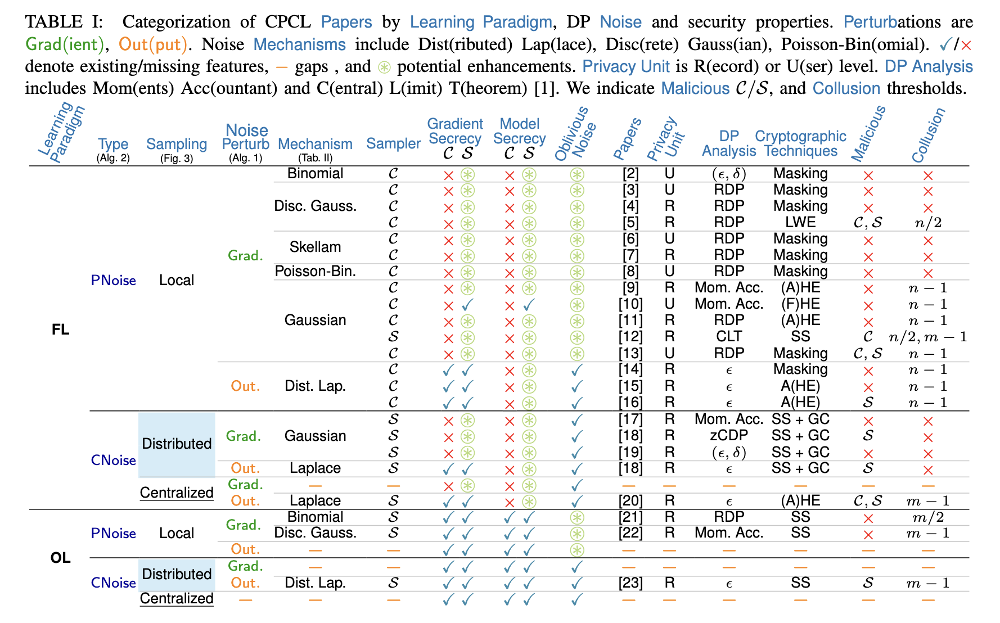

[](https://api.reuse.software/info/github.com/SAP/sok-cpcl)

# SoK: Enhancing Cryptographic Collaborative Learning with Differential Privacy

## About this project
This repository contains the code for the experiments of the paper SoK: Enhancing Cryptographic Collaborative Learning with Differential Privacy accepted at [SaTML 2026](https://satml.org/) available on [arXiv](https://arxiv.org/pdf/2601.09460).

If you find this code useful in your research, please cite our paper:
```
@inproceedings{capano2026sok,
  title={SoK: Enhancing Cryptographic Collaborative Learning with Differential Privacy},
  author={Capano, Francesco and B{\"o}hler, Jonas and Weggenmann, Benjamin},
  booktitle={2026 IEEE Conference on Secure and Trustworthy Machine Learning (SaTML)},
  year={2026},
  organization={IEEE}
}
```

## Abstract
In collaborative learning (CL), multiple parties jointly train a machine learning model on their private datasets. However, data can not be shared directly due to privacy concerns.
To ensure *input confidentiality*, cryptographic techniques, e.g., multi-party computation (MPC), enable training on encrypted data. Yet, even securely trained models are vulnerable to inference attacks aiming to extract memorized data from model outputs.
To ensure *output privacy* and mitigate inference attacks, differential privacy (DP) injects calibrated noise during training. 
While cryptography and DP offer complementary guarantees, combining them efficiently for cryptographic and differentially private CL (CPCL) is challenging. Cryptography incurs performance overheads, while DP degrades accuracy, creating a privacy-accuracy-performance trade-off that needs careful design considerations.

This work systematizes the CPCL landscape. We introduce a unified framework that generalizes common phases across CPCL paradigms, and identify secure noise sampling as the foundational phase to achieve CPCL.
We analyze trade-offs of different secure noise sampling techniques, noise types, and DP mechanisms discussing their implementation challenges and evaluating their accuracy and cryptographic overhead across CPCL paradigms. 
Additionally, we implement identified secure noise sampling options in MPC and evaluate their computation and communication costs in WAN and LAN. 
Finally, we propose future research directions based on identified key observations, gaps and possible enhancements in the literature. 


## Systematization Table
Feel free to contribute to and update our systematization table which categorizes and compares different approaches for encrypted and differentially private collaborative learning.


The LaTeX source code for the summary table is in the `summary_table/` folder with the PDF version which includes the bibliography.

## Evaluation Overview

This project evaluates three main areas:

1. **Accuracy Trade-offs** — Model accuracy under privacy-accuracy trade-offs in `trade_offs_evaluation`.
   - Centralized learning (plaintext and DP-SGD baselines).
   - Federated Learning (FL) with and without DP.
   - Outsourced Learning (OL) with secure MPC with and without DP.
   - **See:** [trade_offs_evaluation/README.md](trade_offs_evaluation/README.md).

2. **Performance Overhead** — Cryptographic and DP costs in `trade_offs_evaluation/performance_eval`.
   - Communication and computation overhead from DP mechanisms.
   - Secure noise sampling in multi-party computation.
   - **See:** [trade_offs_evaluation/performance_eval/README.md](trade_offs_evaluation/performance_eval/README.md).

3. **Noise Mechanisms** — Secure noise sampling evaluation in `mpc_noise_sampling`.
   - Laplace, Gaussian (continuous & discrete), and Skellam distributions.
   - MP-SPDZ-based implementations in LAN and WAN settings.
   - **See:** [mpc_noise_sampling/README.md](mpc_noise_sampling/README.md).

## Requirements and Setup

### General Requirements

- **Python 3.8+** with pip
- **Git** for cloning submodules
- Platform-specific tools (see folder-specific READMEs)

### Project Structure & Setup

The project contains two independent evaluation frameworks:

#### 1. Privacy-Accuracy-Performance Trade-offs Evaluation
Evaluate accuracy and performance across centralized, federated, and outsourced learning paradigms.

**See:** [trade_offs_evaluation/README.md](trade_offs_evaluation/README.md) for:
- Python dependencies and CrypTen setup
- Notebook descriptions and usage
- DP training implementation details

```bash
cd trade_offs_evaluation
pip install -r requirements.txt
cd Crypten && python setup.py install && cd ..
```

#### 2. MPC Noise Sampling Experiments
Benchmark secure noise sampling techniques using MP-SPDZ for DP mechanisms.

**See:** [mpc_noise_sampling/README.md](mpc_noise_sampling/README.md) for:
- Python noise sampling utilities
- MP-SPDZ build and compilation
- Running experiments on single/multiple machines
- Parsing results and generating plots

```bash
cd mpc_noise_sampling
pip install -r requirements.txt
./scripts/build_mp_spdz_macos.sh  # or build_mp_spdz_linux.sh
```

#### 3. Systematization Table
Contributes to a comprehensive comparison of CPCL approaches.

**See:** [summary_table/README.md](summary_table/README.md) for LaTeX source and build instructions.

## Support, Feedback, Contributing

This project is open to feature requests/suggestions, bug reports etc. via [GitHub issues](https://github.com/SAP/sok-cpcl/issues). Contribution and feedback are encouraged and always welcome. For more information about how to contribute, the project structure, as well as additional contribution information, see our [Contribution Guidelines](CONTRIBUTING.md).

## Security / Disclosure
If you find any bug that may be a security problem, please follow our instructions at [in our security policy](https://github.com/SAP/sok-cpcl/security/policy) on how to report it. Please do not create GitHub issues for security-related doubts or problems.

## Code of Conduct

We as members, contributors, and leaders pledge to make participation in our community a harassment-free experience for everyone. By participating in this project, you agree to abide by its [Code of Conduct](https://github.com/SAP/.github/blob/main/CODE_OF_CONDUCT.md) at all times.

## Licensing

Copyright 2025 SAP SE or an SAP affiliate company and sok-cpcl contributors. Please see our [LICENSE](LICENSE) for copyright and license information. Detailed information including third-party components and their licensing/copyright information is available [via the REUSE tool](https://api.reuse.software/info/github.com/SAP/sok-cpcl).

## Acknowledgement

This work has received funding from the European Union's Horizon Europe research and innovation program under grant agreement No 101070141 ([GLACIATION](https://glaciation-project.eu/)).
